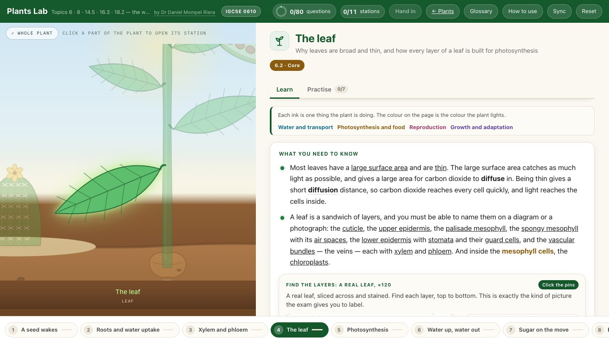

<div align="center">

<h1>🌱 &nbsp;Plants Lab</h1>

**Cambridge IGCSE Biology 0610 · the plant topics — 6, 8, 14.5, 16.3 and 18.2**

[](https://mompel226.github.io/plants-lab/)


by **Dr Daniel Mompel Riera** · NLCS Jeju

</div>



---

## What a student does

Click a part of the plant and work through what it does: the theory in the wording the exam wants,
the pictures from the lessons, the videos, and questions that say right or wrong — never the answer.

|  |  |
|---|---|
| 🌱 **12 stations** | a seed wakes · roots and water uptake · xylem and phloem · the leaf · photosynthesis · water up, water out · the potometer · sugar on the move · bending to the light · the flower · from flower to seed · built for its place |
| ✍️ **91 questions** | fill the gaps · drag & drop · multiple choice · put in order · match up · sort into groups · **tick a grid** · **click the picture** |
| 🔬 **The exam's pictures** | a real leaf, root and stem cut across and stained, with the layers to find; a half-flower to label; wheat anthers to point at; a leaf tested for starch |
| 🧪 **The investigations** | germination, the starch test, limiting factors, a seedling on its side — each one worked through as the exam sets it |
| 🔬 **A potometer you run** | choose the plant, set light, temperature, humidity, wind, the leaves, the joint at the bung and the time, start the clock and watch the bubble; record runs into a table, get a mean when you repeat one, use a new shoot for a true replicate, and a graph that picks its own axis from what you changed |
| 🎯 **Evaluating it** | systematic and random error, accuracy, precision, reliability and validity, in the potometer — taught from the students' own guide and tested in the questions; the results table keeps up to five trials per set of conditions and works out the mean, standard deviation, standard error and a 95 % confidence interval, each explained on a click, with error bars or a confidence band on the graph |
| 🎞 **Eight lesson videos** | germination, the coloured-flower experiment, water uptake, water transport, the potometer, transport in the stem, photosynthesis, a tropism time-lapse — the ones shown in class, built in |
| 📖 **A shared glossary** | one wording per term, the same in every lab |

> [!NOTE]
> **The answers are not in the page — at all.** The lab can tell a student they are wrong, but
> nothing in it knows what *right* is. There is no setting that reveals the answers, because
> there is nothing to reveal. How that works is explained below.

## Where it sits

Behind the [Plants Hub](https://mompel226.github.io/plants-hub/), one shelf of the
[Biology Hub](https://mompel226.github.io/biology-hub/) — the front door to every Biology app
here. The **← Plants** button goes back up, and a stage of the plant on that hub opens the
matching station here.

> [!TIP]
> **Want your students' scores in a spreadsheet of your own?**
> Set it up once, for every lab at the same time:
> **[Would you like to see how your students are doing?](https://github.com/Mompel226/biology-hub#-would-you-like-to-see-how-your-students-are-doing)**

<details>
<summary><b>Behind the scenes</b> — how this lab works, in plain English</summary>

<br>

**One plant, two places.** The plant on the left is not a picture — it is drawn by the page from a
single written description of its parts and the stages it grows through. That same description
draws the plant on the [Plants Hub](https://mompel226.github.io/plants-hub/), so both show exactly
the same plant and correcting it once corrects it in both. Each station lights the part it is
about, flies to it, and where it helps, sets the sap running or the leaves breathing.

**Why the answers are not in the page.** This is the part worth understanding.

Anything a web page can show, a student can find by digging around in it. So the answers are
never sent to the student at all. Instead, each question carries a *scrambled fingerprint* of
its answer. When a student answers, the page scrambles what they did in exactly the same way and
compares the two fingerprints. The same answer always makes the same fingerprint, so a match
means they were right.

Scrambling only works one way — you cannot start from a fingerprint and work back to the answer.
So nothing in the page can say what the right answer is. It can only ever say *not that one*.

The real answers live in one file on my own computer, which is never published.

**What is shared with the other labs.** Drawing a question, handling the dragging, the marking,
the sync between devices, the widgets that the theory pages are built from, the glossary and the
plant are all kept in one place and copied in whenever a lab is rebuilt, so a fix reaches every
lab at once. What belongs to this lab alone is its content: the 12 stations, the 91 questions,
the pictures, the videos, and the twelve small interactive pieces of theory — a seed that
germinates, an equation that assembles, a graph of limiting factors, a starch test, a potometer,
a seedling that bends, a flower to label, a pollen tube that grows.

**Rebuilding it** (only needed if you change the content). One command reads the master file
with the answers in it and writes out the published version with only the fingerprints. It
refuses to finish unless every answer still marks correctly.

```
node tools/build.mjs
```

**Copying it for your own school.** Everything the page needs is in this repository, so a copy
runs straight away. You cannot change the questions, because the file with the answers was never
published. If you just want to use the lab, send your students the link — there is nothing to
copy.

Picture and video credits: [`assets/photos/CREDITS.md`](assets/photos/CREDITS.md).

</details>

Made by **Dr Daniel Mompel Riera** · Biology, NLCS Jeju ·
[dmompelriera@nlcsjeju.kr](mailto:dmompelriera@nlcsjeju.kr)
